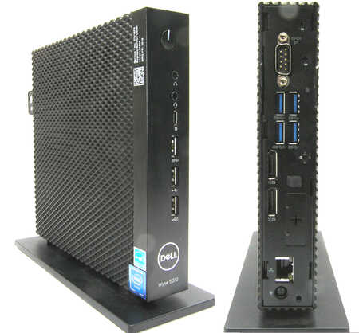

# Hardware

## What I have - The fleet

- Tower PC (Ryzen 5 2600X, GTX 1660 Super): daily use PC, kept outside of the lab.
- ThinkPad X230: portable laptop, used to remotely control the server over SSH.
- ThinkPad W540: main coding / lab machine (not mainly used for this project).
- Sony Vaio (2012): retired from active use, donated its 500GB HDD to the server.
- Dell Wyse 5070: mini PC used for the server itself.

## Why a Dell Wyse 5070 for the server

Considerations:

- Raspberry Pi 4: Would struggle with video transcoding, better suited for something lightweight project like Pi-hole later. Costs around the same as the Dell Wyse.
- Old laptop Sony Vaio: could work but laptop is not best suite for 24/7 continuous load, thermal concern.
- Dell Wyse 5070: Fanless, built specifically for enterprise 24/7 operation, low power draw.

Bought a second hand Dell Wyse 5070 for 99 Euro, 128GB SSD included.

## Storage

Using what I already have laying around, I pulled the 500GB HDD out of the Vaio and put in a external case as an external hard drive for the Wyse.

Important thing to check beforehand: 
- Checked its health first with smartctl before commiting it fully. -> Passed general health
- Reformatted it from exFAT (for cross OS use) to ext4 for Linux native filesystem. 

